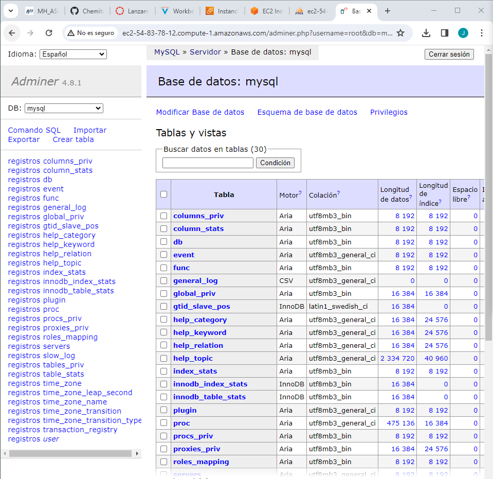

# Actividad 1.3.1 LAMP

Vamos a realizar la instalación de la pila LAMP en nuestro servidor de AWS. para ello instalaremos Apache2 y php.

Primero actualizamos los repositorios con el siguiente comando.
``` 
apt update
```
Una vez hecho esto instalamos Apache2 y php.


Ahora vamos a editar el sitio web por defecto. Este sitio se encuentra en ```/etc/apache2/sites-available``` y modificamos el fichero 000-default.conf para que quede de la siguiente manera.


Lo siguiente es reiniciar el servicio apache2 con el siguiente comando:
``` 
systemctl restart apache2
```

Ahora vamos a hacer la comprobación de LAMP stack. Para ello vamos a crear una página de prueba para testear php en el "documentroot" del sitio web por defecto. El archivo debe tener lo siguiente:


Comprobamos que se ha realizado correctamente al abrir la página web que muestra lo siguiente:


Ahora procederemos con la instalacion del MariaDB. Para ello tenememos que comenzar la instalación del servidor de base de datos y del cliente con el siguiente comando.

``` 
apt install -y mariadb-server mariadb-client
```

Una vez instalado, accedemos a MariaDB desde la consola del servidor con el usuario de root.


Cunado nos hayamos logeado con el usuario root, tenemos que cambiar la contraseña de dicho usuario de la siguiente manera.


Con esto ya tendremos instalado MariaDB, por lo que solo nos falta PHPMyAdmin para tener instalados todos los programas necesarios para tener la pila LAMP al completo.  
Primero comenzamos instalándonos PHPMyAdmin en nuestra máquina virtual con el siguiente comando.

``` 
apt install phpmyadmin php-mbstring php-zip php-gd php-json php-curl -y 

```
Durante la instalación tenemos que seleccionar la siguiente configuración para realizarla correctamente.


Con esto iniciará la instalación y nos pedirá confirmar que si que deseamos utilizar dbconfig-common para configurar la base de datos. A continuación nos pedirá introducir una contraseña para phpMyAdmin, la cual será **alumno222**.  

Con esto ya podremos acceder a phpMyAdmin desde un navegador mediante el DNS de Ipv4 pública que nos ofrece AWS completándolo con un */phpmyadmin*. Se nos abrirá una página de inicio donde pondremos nuestro usuario y contraseña que creamos en MariaDB.


Con esto completado ya habremos instalado la pila LAMP completamente en nuestra máquina virtual de AWS. Solo falta hacer la instalación del adminer, para ello buscamos en Google Adminer y descargamos el fichero de Adminer for MySQL.


Con esto volvemos a nuestro servidor y copiamos la dirección de descarga del enlace y lo instalamos en el servidor.


Comprobamos que se ha instalado y lo movemos a la carpeta **/var/www/html**. Una vez movido le cambiamos el nombre a *adminer.php*.


Por último iniciamos sesión en la base de datos poniendo nuestra ip pública con un */adminer.php*



Una vez hecho esto solo falta mostrar que nos podemos conectar al servidor correctamente con la ip pública.

